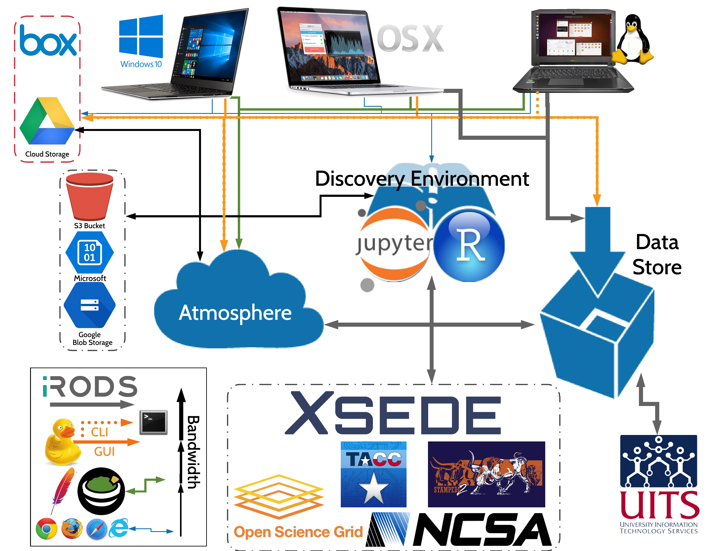

|CyVerse logo|_

|Home_Icon|_
`Learning Center Home <http://learning.cyverse.org/>`_

Data Download
--------------

**Description: Managing your data on CyVerse**

`Official CyVerse Data Management <http://www.cyverse.org/manage-data>`_

`Using CyVerse iCommands <https://pods.iplantcollaborative.org/wiki/display/DS/Using+iCommands>`_

`Official iCommands User <https://docs.irods.org/4.2.2/icommands/user/>`_

..
	#### Comment: short text description goes here ####

----

**Data Sharing Services:**

|Cyverse_data_services|

.. list-table::
    :header-rows: 1

    * - Input
      - Description
      - Link
    * - Google Drive
      - Cloud Data Storage Service
      - `Jupyter Client <https://github.com/jupyterlab/jupyterlab-google-drive>`_
    * - Cyverse Data Store
      - integrated Rule-Oriented Data System (iRODS)
      - `Jupyter Client <https://www.npmjs.com/package/@towicode/jupyterlab_irods>`_
    * - CyberDuck
      - File Share UI
      - `Using with CyVerse <https://pods.iplantcollaborative.org/wiki/display/DS/Using+Cyberduck+for+Uploading+and+Downloading+to+the+Data+Store>`_
    * - Guacamole 
      - Atmosphere Browser Tabs
      - 

*Google Drive Jupyter Client*
~~~~~~~~~~~~~~~~~~~~~~~~~~~~~

.. Note::

    As of July 2018, the Google Drive Jupyter Client has been deprecated. 

Update Conda to latest

	.. code-block :: bash
	
		conda update conda
		conda update conda-build
	
Dependency: `Node.js 5+ <https://www.digitalocean.com/community/tutorials/how-to-install-node-js-on-ubuntu-16-04>`_ 

	.. code-block :: bash
	
		conda install -c conda-forge nodejs

1. Install `Google Drive to Jupyter Lab <https://github.com/jupyterlab/jupyterlab-google-drive>`_

Google Drive requires port ``8888`` or ``8889`` with port forwarding to work

	.. code-block :: bash
	
		jupyter labextension install @jupyterlab/google-drive

*iRODS Jupyter Client*
~~~~~~~~~~~~~~~~~~~~~~

CyVerse has a developed a `Jupyter Lab iRODS <https://www.npmjs.com/package/@towicode/jupyterlab_irods>`_ client similar to the Google Drive extension.

	.. code-block :: bash
	
		pip install jupyterlab_irods
		jupyter serverextension enable --py jupyterlab_irods
		jupyter labextension install @towicode/jupyterlab_irods

*iRODS iCommands CLI*
~~~~~~~~~~~~~~~~~~~~~

`CyVerse Instructions <https://pods.iplantcollaborative.org/wiki/display/DS/Setting+Up+iCommands>`_

`Instructions from iRODS <https://packages.irods.org>`_

`Download from iRODS <https://irods.org/download/>`_

1. Install iCommands on the VM

	.. code-block :: bash

		  wget -qO - https://packages.irods.org/irods-signing-key.asc | sudo apt-key add -
		  echo "deb [arch=amd64] https://packages.irods.org/apt/ $(lsb_release -sc) main" | sudo tee /etc/apt/sources.list.d/renci-irods.list
		  sudo apt-get update
		  sudo apt-get install irods-icommands

2. Initialize iRODS-iCommands

	.. code-block :: bash
	
		  iinit

You will be queried to set up your `irods_environment.json`

Enter the following:

.. list-table::
    :header-rows: 1
    
    * - statement
      - input
    * - DNS
      - *data.cyverse.org*
    * - port
      - *1247*
    * - username
      - *your CyVerse username*
    * - zone
      - *iplant*
     
.. Note::

  Set up auto-complete for iCommands `instructions <https://pods.iplantcollaborative.org/wiki/display/DS/Setting+Up+iCommands>`_

  Download `i-commands-auto.bash <https://pods.iplantcollaborative.org/wiki/download/attachments/6720192/i-commands-auto.bash>`_

  In your home directory, rename ``i-commands-auto.bash`` to ``.i-commands-auto.bash``

  In your ``.bashrc`` or ``.bash_profile``, enter the following:
  
	.. code-block :: bash
	
		source .i-commands-auto.bash

*CyberDuck*
~~~~~~~~~~~

CyberDuck is a GUI client that works in Windows and Mac OS X. It can connect to almost every type of proximate file sharing system (DropBox, Drive, AWS S3, SFTP, iRODS, etc).

`Using CyVerse and CyberDuck <https://pods.iplantcollaborative.org/wiki/display/DS/Using+Cyberduck+for+Uploading+and+Downloading+to+the+Data+Store#>`_

CyberDuck also has a `CLI client <https://duck.sh/>`_ that can be used in Linux.

To install on the VM:

	.. code-block :: bash

		echo -e "deb https://s3.amazonaws.com/repo.deb.cyberduck.io stable main" | sudo tee /etc/apt/sources.list.d/cyberduck.list > /dev/null
		sudo apt-key adv --keyserver keyserver.ubuntu.com --recv-keys FE7097963FEFBE72
		sudo apt-get update
		sudo apt-get install duck

..
	#### Comment: Suggested style guide:
	1. Steps begin with a verb or preposition: Click on... OR Under the "Results Menu"
	2. Locations of files listed parenthetically, separated by carets, ultimate object in bold
	(Username > analyses > *output*)
	3. Buttons and/or keywords in bold: Click on **Apps** OR select **Arabidopsis**
	4. Primary menu titles in double quotes: Under "Input" choose...
	5. Secondary menu titles or headers in single quotes: For the 'Select Input' option choose...
	####

*Guacamole*
~~~~~~~~~~~

Open the Web Desktop or Web Shell from the Atmosphere UI

``Ctrl + Alt + Shift`` to open the side bar.

Click on ``Devices``

Select the ``Home`` folder (or a folder that your $USER has ownership of) and upload data.

----

**Description of output and results**

Congratulations! You've established ways to get data to and from your VM!

----

**Fix or improve this documentation**

- On Github: `Repo link <https://github.com/CyVerse-learning-materials/neon_data_science>`_
- Send feedback: `Tutorials@CyVerse.org <Tutorials@CyVerse.org>`_

----

|Home_Icon|_
`Learning Center Home <http://learning.cyverse.org/>`_
    
.. |CyVerse logo| image:: ./img/cyverse_rgb.png
    :width: 500
    :height: 100
    
.. _CyVerse logo: http://learning.cyverse.org/
.. |Home_Icon| image:: ./img/homeicon.png
    :width: 25
    :height: 25

    
.. _Home_Icon: http://learning.cyverse.org/
